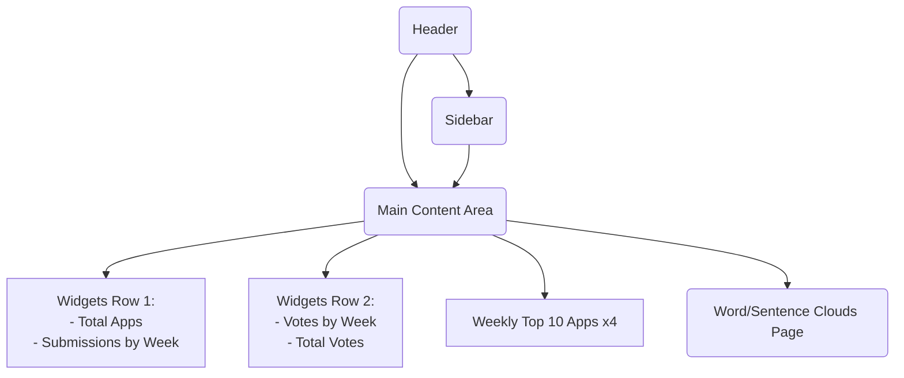

# Dashboard Analytics & Widgets Implementation Guide

This guide covers the comprehensive, detailed process for implementing a modern React-based dashboard in a teal/minimalistic style for the analytics widgets specified:  
- **Total Apps and Submissions by Week**
- **Votes by Week & Total Votes**
- **Top 10 Apps per Week (4 weekly widgets)**
- **Dedicated Page for Word Clouds and Sentence Cloud**  
All widgets are powered by real data parsed from `src/app.json`.

---

## 1. Project Structure & Data Use

### Core Files
- **App.js** – Entrypoint for theming/toggles and general layout.
- **app.json** – The static dataset with all application and contest analytics.

### Data Loading
- Use React's `useEffect`/`useState` or utility modules to load and parse JSON:
  ```js
  import data from './app.json';
  // OR load dynamically with fetch if not using import (e.g., if moving JSON outside src)
  ```

---

## 2. General Design & Layout Principles

### Visual Identity
- **Teal-based palette:** #1976D2 (as a primary accent), with clean whites, subtle greys, and teal accents.
- **Minimalism:** Ample whitespace, simple card containers, and clear sans-serif typography.
- **Modern look:** Large section headers, iconography, pill-shaped buttons, and shadow/layer effects.
- **Responsiveness:** Widgets are card-based and use responsive grid or flex layouts (e.g., CSS Grid, Flexbox).

### Example Layout Diagram


---

## 3. Widget-by-Widget Implementation Details

### 3.1 Total Apps & Submissions by Week

**Data Source/Field:**  
- Count all array entries for total apps.
- For week-by-week submissions, group by `contest_week_id` and count.

#### Example Parsing Code
```js
// Assuming `apps` is the imported/loaded JSON array:
const totalApps = apps.length;

const submissionsByWeek = apps.reduce((acc, app) => {
  const week = app.contest_week_name || `Week ${app.contest_week_id}`;
  acc[week] = (acc[week] || 0) + 1;
  return acc;
}, {});
```

#### Widget Design Notes
- **Total Apps Widget:** Large, centered number, label underneath. Card with teal border or background accent.
- **Submissions by Week Widget:** Use a simple bar chart or horizontal bar of pills per week, with labels. Teal for filled/active, light grey for background.

#### Mockup Hint
- *Total Apps*:  
  ```
  +------------------+
  |   157           |
  | Total Apps      |
  +------------------+
  ```
- *Submissions by Week*:  
  ```
  +------------------+
  | Week 1: |||||| 15|
  | Week 2: ||||  12|
  | ...              |
  +------------------+
  ```

### 3.2 Votes By Week & Total Votes

**Data Source/Field:**  
- Each app has a `vote_count` and is associated with a week (`contest_week_id`).

#### Example Parsing
```js
const totalVotes = apps.reduce((sum, app) => sum + (app.vote_count || 0), 0);

const votesByWeek = apps.reduce((acc, app) => {
  const week = app.contest_week_name || `Week ${app.contest_week_id}`;
  acc[week] = (acc[week] || 0) + (app.vote_count || 0);
  return acc;
}, {});
```

#### Widget Design
- **Total Votes Widget:** Similar to Total Apps – big digit, secondary label.
- **Votes By Week Widget:** Small multi-bar, or line chart, teal bars/circles with hover / active highlight.
- Place both in one row, spaced apart (either grid 2-columns or flex row).

#### Mockup Hint
  ```
  +-------+   +------------+
  | 1893  |   |   Week 1   |
  | Votes |   | ===== 124  |
  +-------+   |   ...      |
              +------------+
  ```

---

### 3.3 Top 10 Apps per Week Widgets (4 widgets)

**Overview:**  
- For each contest week (1-4), show a widget displaying the top 10 apps (by `vote_count`).
- Display each app’s thumbnail (`image_url`), name, "Visit App" link, and vote count.

**Data Handling:**
```js
const appsByWeek = {};
apps.forEach(app => {
  const week = app.contest_week_id;
  if (!appsByWeek[week]) appsByWeek[week] = [];
  appsByWeek[week].push(app);
});
const top10ByWeek = {};
Object.keys(appsByWeek).forEach(week => {
  top10ByWeek[week] = appsByWeek[week]
    .sort((a, b) => (b.vote_count || 0) - (a.vote_count || 0))
    .slice(0, 10);
});
```

**Widget UI:**
- Four parallel/stacked cards (one for each week).
- Each card:  
  - Header (e.g., "Week 1 Top 10")
  - App thumbnails as rounded icons or small tiles
  - Beside/Below:  
      - Name (truncate or ellipsis if long)
      - "Visit App" link (open in new tab, accent teal)
      - Vote count in a pill/badge (teal background, white text)

**Modern Visual Touches:**
- Soft drop-shadows
- Rounded corners
- Interactive hover for thumbnails ("Visit" button lightens or elevates)
- Use subtle teal gradient highlights for active week or for the most-voted app

**Mockup (Textual)**
```
+---------------------------+
| Week 1 Top 10             |
|---------------------------|
| [img] Name      [Votes][Visit] |
| [img] Name      [Votes][Visit] |
| ...                           |
+---------------------------+
```

---

### 3.4 Word Clouds and Sentence Cloud

**Data Source/Fields:**
- *Third-party integrations:* `third_party_integrations` (string, can be parsed as comma- or line-separated)
- *Unique features:* `unique_features`
- *Challenges faced:* `challenges_faced` (sentence cloud)

**Processing Steps:**
- Extract, flatten, and group all non-null entries of these fields across all apps/weeks.
- For word clouds: tokenize (split), count frequency, remove stopwords/common words.
- For sentence cloud: concatenate all sentence/paragraph text; visually display sentences with size/opacity correlating to frequency of similar phrases (sentence clustering optional).

**Example Word Extraction**
```js
function getWordList(field) {
  return apps
    .map(app => app[field])
    .filter(Boolean)
    .join('\n')
    .split(/\\W+/)
    .map(word => word.toLowerCase())
    .filter(word => word.length > 2 && !stopwords.has(word));
}
```
(A full library like `d3-cloud` or `wordcloud2.js` can be integrated for the visual.)

**Page Layout:**
- Create a **dedicated analytics/page route** (e.g., `/analytics/wordclouds`).
- The page contains **three cards/sections**:
  1. *Third-party integrations* word cloud
  2. *Unique features* word cloud
  3. *Challenges faced* (sentence cloud; larger/unique phrases shown bigger, tooltips for full sentences)

**Design Hints:**
- Centered, square card per cloud
- Primary word color: teal (#1976D2), alternates: grey, soft blue
- Minimal grid (3-up on desktop, stacked on mobile)
- Section labels atop each cloud, with tooltip info ("Counts frequency from all weeks")

**Mockup**
```
+-----------+ +----------+ +-----------------+
|  Cloud 1  | | Cloud 2  | |  Sentences coud |
| (TPIs)    | | (Features)| | (Challenges)    |
+-----------+ +----------+ +-----------------+
```

---

## 4. Integration & Component Structure

- Each widget should be a **reusable functional React component**.
- All components receive parsed/filtered data as props, not doing their own I/O.
- Use a **DashboardLayout** component for main area, and a **WordCloudPage** for clouds.
- UI library is optional; if used, favor MUI or ChakraUI for fast teal/minimal stylings.
- Otherwise, CSS modules or styled-components for theme.

### Example Component Stubs
```js
// DashboardWidgets.js
export function TotalAppsWidget({ count }) { /* ... */ }
export function SubmissionsByWeekWidget({ data }) { /* ... */ }
// ... etc

// TopAppsWidget.js
export function TopAppsWidget({ apps, week }) { /* ... */ }

// WordCloudPage.js
export function WordCloudSection({ words, title }) { /* ... */ }
export function SentenceCloudSection({ sentences, title }) { /* ... */ }
```

---

## 5. Visual Consistency Notes

- **Typography:** Use clear modern sans-serif; increase contrast for numbers/labels.
- **Spacing:** ~1.5–2rem padding around widgets, 1rem between.
- **Interactivity:** Subtle shadows or scale on card hover and button tap.
- **Color rules:** Teal for actions and numerics, light backgrounds, grey borders for widget separation.

---

## 6. Data Handling Best Practices

- Always handle missing/null fields defensively (e.g., `vote_count || 0`).
- Sort weeks and apps numerically/alphabetically for clarity.
- Wrap cloud and chart widgets in try/catch for error display if malformed data.

---

## 7. Example Implementation Snippet

```js
// Load and prepare analytics data
import apps from './app.json';

// Parse, group, and pass data to widgets
const dashboardData = {
  totalApps: apps.length,
  submissionsByWeek: /* ... */,
  totalVotes: /* ... */,
  votesByWeek: /* ... */,
  top10ByWeek: /* ... */,
  thirdPartyCloud: /* ... */,
  uniqueFeaturesCloud: /* ... */,
  challengesSentences: /* ... */
};
```

---

## 8. Further Enhancements

- *Add week and app filters, search, or sort toggles for interactivity*
- *Support theme switching (integrated with current App.js theme toggle)*
- *Accessibility testing: ensure keyboard nav, color contrast pass*

---

## 9. References (for future extension)

- Word cloud libraries: [`d3-cloud`](https://github.com/jasondavies/d3-cloud), [`react-wordcloud`](https://www.npmjs.com/package/react-wordcloud)
- Charting: [`recharts`](https://recharts.org/), [`chart.js`](https://www.chartjs.org/)

---

## 10. Sources

- `src/app.json` (all widgets parse from this real file)
- `src/App.js` (existing theming/toggle structure referenced)

---

Task completed: This markdown document provides comprehensive guidance—for code, layout, visual and style requirements, and mockup hints—on implementing all specified analytics widgets in a teal/minimal React dashboard, using real data from app.json as requested.
