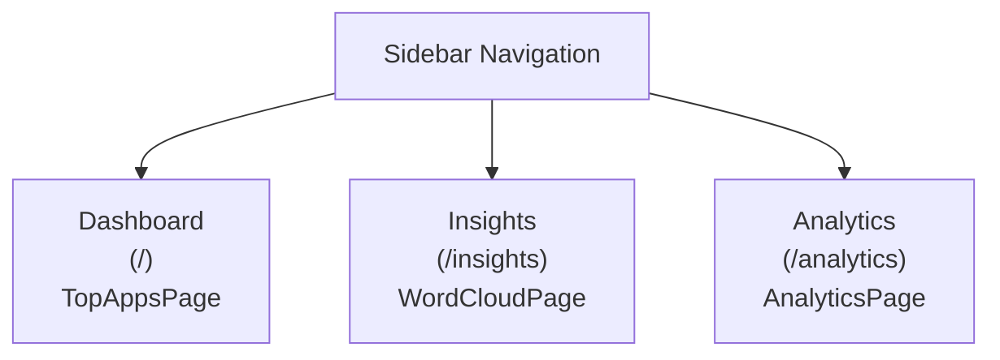

# Sidebar Navigation and Page Mappings: Dashboard Frontend

This document summarizes the sidebar navigation entries in the dashboard frontend, listing each sidebar item, its route, the mapped page/component, and a description of the current purpose of each page as implemented.

| Sidebar Label | Route Path   | Component/Page     | Purpose/Description                                                                                                                                              |
|---------------|-------------|--------------------|------------------------------------------------------------------------------------------------------------------------------------------------------------------|
| Dashboard     | `/`         | TopAppsPage        | Displays a weekly breakdown of the top 10 apps per week. Provides a modern, tab-based interface that allows users to see, filter, and explore leading apps, sourced dynamically from JSON data. Grid cards present each app's details, image, link, and vote count. Tabs allow navigation between weeks or viewing all weeks at once. |
| Insights      | `/insights` | WordCloudPage      | Presents interactive word/sentence clouds visualizing the most prominent third-party integrations, unique features, and challenges derived from all app entries. Users can switch between integrations, features, and challenges via tabs; the visualizations emphasize importance based on frequency and prominence among top-voted apps. |
| Analytics     | `/analytics`| AnalyticsPage      | Provides a comprehensive analytics dashboard with charts, trends, and high-level summaries of app submissions and votes. Visualizes weekly trends (bar/line charts), total submission/vote counts, and a breakdown of vote distribution by week, all using robust data extraction and aggregation from the static JSON source.         |

## Additional Details

- **Sidebar Location**: The sidebar is a persistent navigation element on the left, implemented in the `Sidebar` component within `App.js`.
- **Navigation Logic**: Each sidebar label is a React Router `Link` directing to its target route. Navigation is client-side and routes map exactly to the component listed.
- **Data Source**: All pages render data/elements dynamically from the static `app.json` file found in the `src` directory.
- **Style/Theme**: The application uses a modern, minimalistic theme with teal, blue, and accent color palette.

## Mermaid Diagram: Navigation Structure

## Source Files

- Navigation: `src/App.js`
- Dashboard Page: `src/TopAppsPage.js`
- Insights Page: `src/WordCloudPage.js`
- Analytics Page: `src/AnalyticsPage.js`

---
This documentation reflects the application's actual sidebar, routes, and mapped components as of the current implementation.
